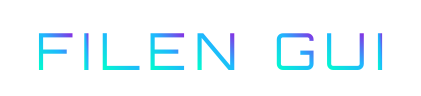
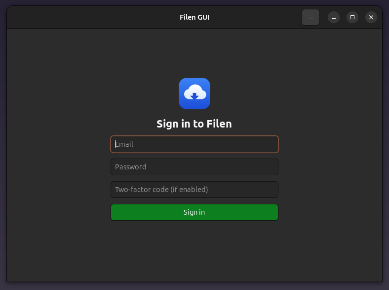

<div align="center">

<a href="https://github.com/effjy/filen-gui/"></a>


</div>

A native **C++ / GTK4** desktop client for [Filen.io](https://filen.io), the
end-to-end encrypted cloud storage service. Sign in to your Filen account,
browse your folders, and upload, download or delete your files — all encrypted
and decrypted **locally** on your machine.

Author: **Jean-Francois Lachance-Caumartin**
Credits: **Filen.io Team** (for the open-source SDK that documents the protocol).

## Screenshot



## Features

- Secure login (Filen auth versions **2** and **3**, including two-factor codes)
- End-to-end decryption performed locally (PBKDF2 / Argon2id + AES-256-GCM)
- Browse folders with back / refresh navigation
- **Download** the selected file to any location
- **Upload** a file into the current folder (single- and multi-chunk)
- **Trash** the selected file or folder (move to the Filen recycle bin)
- **Empty Trash** to permanently delete trashed items — auto-disabled when the
  trash is empty
- Global application icon shown in the taskbar / application menu
- About dialog with author and Filen.io Team credits

## 1. Install the prerequisites

You need a C++17 compiler, `make`, `pkg-config`, and the development packages
for GTK4, libcurl, OpenSSL and Argon2.

### Debian / Ubuntu

```sh
sudo apt update
sudo apt install build-essential pkg-config \
    libgtk-4-dev libcurl4-openssl-dev libssl-dev libargon2-dev
```

### Fedora

```sh
sudo dnf install gcc-c++ make pkgconf-pkg-config \
    gtk4-devel libcurl-devel openssl-devel libargon2-devel
```

### Arch Linux

```sh
sudo pacman -S base-devel pkgconf gtk4 curl openssl argon2
```

> The JSON parser ([nlohmann/json](https://github.com/nlohmann/json)) is vendored
> in `src/vendor/json.hpp`, so no extra package is required for it.

## 2. Compile and install

```sh
make                 # build the ./filen-gui binary
sudo make install    # install the binary, icon and .desktop entry
```

`make install` places:

| File | Destination |
|------|-------------|
| `filen-gui` binary | `/usr/local/bin/` |
| `io.github.jflc.FilenGUI.desktop` | `/usr/local/share/applications/` |
| `io.github.jflc.FilenGUI.svg` (icon) | `/usr/local/share/icons/hicolor/scalable/apps/` |

You can override the install prefix, e.g. `sudo make install PREFIX=/usr`.

To remove everything that was installed:

```sh
sudo make uninstall
```

## 3. Use the program

Launch **Filen GUI** from your applications menu, or run `filen-gui` from a
terminal.

1. **Sign in** with your Filen email and password. If you have two-factor
   authentication enabled, enter the current code as well.
2. **Browse** your files. Double-click a folder to open it; use the
   **Back** and **Refresh** buttons to navigate.
3. **Select** a file by clicking it once, then use a toolbar action.

### Toolbar

| Button | Action |
|--------|--------|
| ◀ Back | Go up to the parent folder |
| ⟳ Refresh | Reload the current folder |
| ⬇ Download | Save the selected file to your computer |
| ➤ Upload | Upload a file into the current folder |
| ✕ Trash | Move the selected file/folder to the Filen trash |
| 🗑 Empty Trash | Permanently delete everything in the trash (disabled when empty) |

You can sign out or open the About dialog from the **☰ menu** in the title bar.

## Project layout

```
src/crypto.{hpp,cpp}        Filen cryptography (KDFs, AES-GCM, metadata/data)
src/filen_client.{hpp,cpp}  Filen.io HTTP API client and high-level operations
src/main.cpp                GTK4 user interface
src/vendor/json.hpp         Vendored nlohmann/json
data/                       Application icon and .desktop entry
Makefile                    Build / install / uninstall
```

## Future work

Ideas to continue building on later:

- **More file operations** — rename, create folder, and move items. The Filen
  API endpoints for these are siblings of the ones already wired in
  (`/v3/dir/rename`, `/v3/dir/create`, `/v3/file/move`, ...).
- **Persist login** — securely save the encrypted `apiKey` and master keys so
  the password does not have to be re-entered on every launch.
- **Drag-and-drop upload** — drop files directly onto the file list to upload
  them into the current folder.

## Security note

Your password never leaves your machine in plaintext: it is run through the
same key derivation (PBKDF2-SHA512 for auth v2, Argon2id for auth v3) used by
the official client, and only the derived authentication hash is sent to the
server. File contents and metadata are decrypted locally with keys that are
themselves decrypted from your master key.

This is an independent, unofficial client and is not affiliated with Filen.io.

## License

Released under the **MIT License**.
